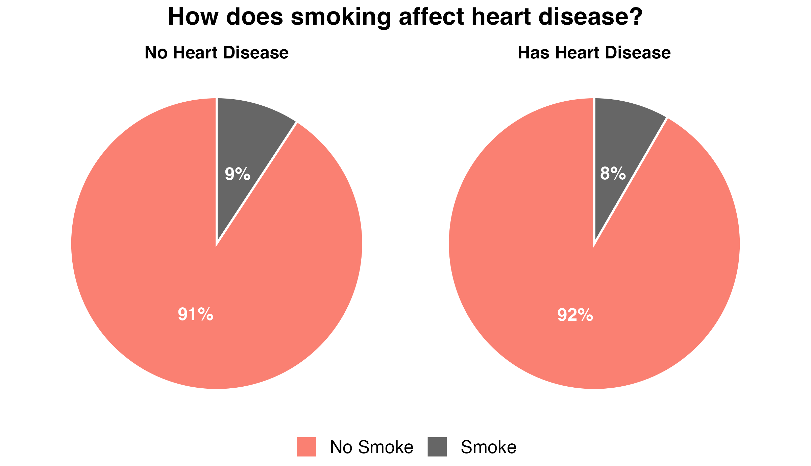
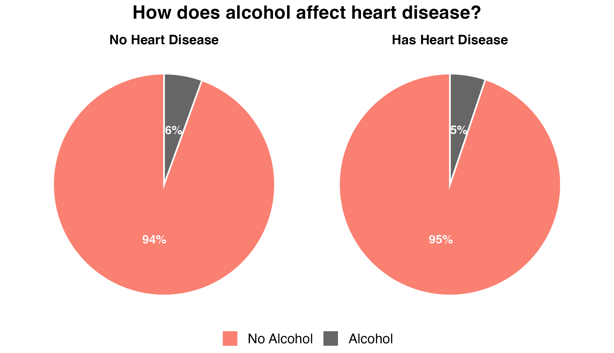

# What Factors Are Most Associated with Heart Disease?

Team project with Toby, Dheeraj, and Chris. Created March 2026.

**Claim:** although age naturally increases the risk of heart disease,
lifestyle factors — smoking, heavy alcohol use, high cholesterol, and high
blood pressure — are major *preventable* contributors that significantly
raise the likelihood of developing heart disease.

## Data

- **1989 dataset** — 303 angiography patients at the Cleveland Clinic
  (Janosi, Steinbrunn, Pfisterer & Detrano, UCI Machine Learning Repository).
- **2020 dataset** — ~70,000 patient records with lifestyle variables
  (smoking, alcohol use), compiled by Svetlana Ulianova (Kaggle).

## Findings

Heart disease is strongly associated with older age, high cholesterol, and
high blood pressure. As individuals age, the effect of high cholesterol on
cardiovascular risk becomes more pronounced.

Smoking and alcohol use, on the other hand, showed almost no difference
between the two groups in this dataset — smokers and drinkers were actually
slightly *less* common among people with heart disease:





This isn't reverse causation — it's a limitation of a purely descriptive,
observational comparison. It doesn't control for age, cholesterol, blood
pressure, BMI, glucose, or physical activity, so it can't isolate the effect
of smoking or alcohol on their own. A logistic regression that controls for
those variables would be a stronger follow-up test.

## Files

```
Data_Visualization_Heart_disease.R        Pie chart analysis (smoking/alcohol vs. heart disease)
Heart_disease_Pie.Rmd                     R Markdown source for the rendered report
Heart_disease_Pie.html                    Rendered report
cardiovascular_diseases_dv3.csv           2020 dataset (Kaggle)
pie_smoke_heart_disease_salmon_gray.png   Smoking chart
pie_alcohol_heart_disease_salmon_gray.png Alcohol chart
Team_Project_Poster.pdf                   Final team poster (annotated)
```
